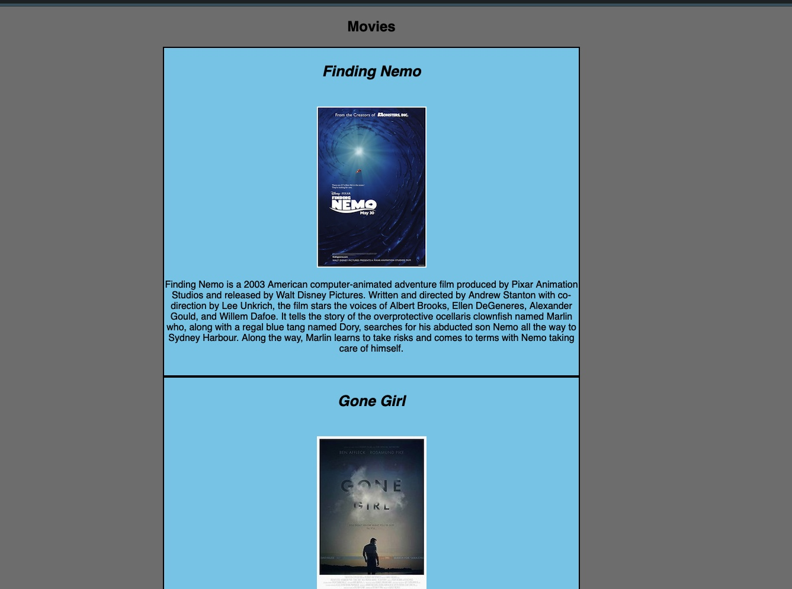
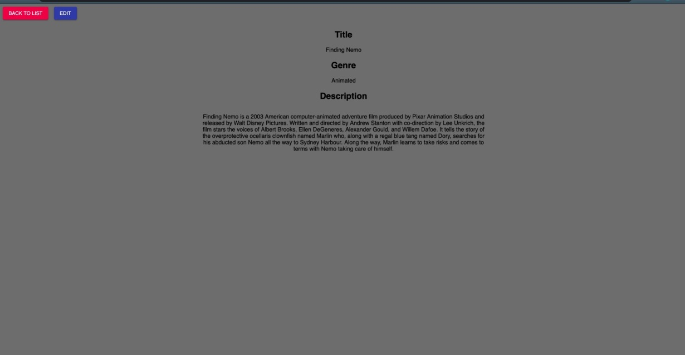
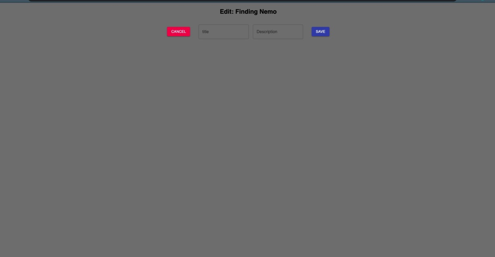

# Redux Movie Sagas

## Summary of Application

- This application is a movie database where it appends a poste, title, and description to the home page. When the user clicks on the image, it will go
to a details page where it displays the title, genre, and description of the specific movie. This will also have an edit feature that allows the user to update the title and description which will update the database and display the new information on the home page. 

## Built With

JavaScript
React.js
Redux
HTML
CSS
SQl
Postgresql

## Getting Started

1. Download this project.
2. `npm install`
3. `npm start`

### Prerequisites

- [Node.js](https://nodejs.org/en/);
- [PostgreSQL](https://eggerapps.at/postico/);
- [React.js]
- [Redux ]

## Screen Shot

### Completed Features

High level list of items completed.

- [x] Collect movies from database and append to home page
- [x] specifically target each movie by clicking on the image which will grab that
      information from the database and place it on details page. 
- [x] Update the title and description of the current movie and save it in the database

### Next Steps

> This section is great to show that you can scope & prioritize. For weekend challenges, if you didn't get to stretch, you could list those here & consider coming back to them if/when you have some extra time (even post graduation).  

Features that you would like to add at some point in the future.

- [ ] Display the current values in the input (title) and textarea (description) on the Edit Page
- [ ] Display all genres on movie list page. Research [array_agg](https://stackoverflow.com/questions/43458174/how-to-save-and-return-javascript-object-with-subarray-in-normalized-sql) to make this possible.
- [ ] Move sagas and reducers out of your `index.js` and into separate files (ideally in `src/redux/reducers` and `src/redux/sagas` folders).
- [ ] Allow the user to refresh the details or edit page. The url for the details page would be something like `/details/1` for movie with id of `1`. Research [react router params](https://reacttraining.com/react-router/web/example/url-params).
- [ ] Allow the user to add a genre to a movie.
- [ ] Allow the user to remove a genre from a movie.
- [ ] Only display the top 10 movies, and allow the user to search for movie titles with a search bar on the home page (you can do this on the client side or the server side, server side is a bigger stretch, but good practice).
- [ ] Create an `Admin` page. Add a link from the `Home` page to the `Admin` page. The page should initially display a login form (an input for username and an input for password). When the user enters the correct username (`camera`) and password (`action`), the page should display a form to add genres to the database, and a list of all of the genres with an `x` to remove them from the database. Note: This isn't actually secure, but it's pretty fun, and really good practice.

## Acknowledgments

  - Mark McNally

